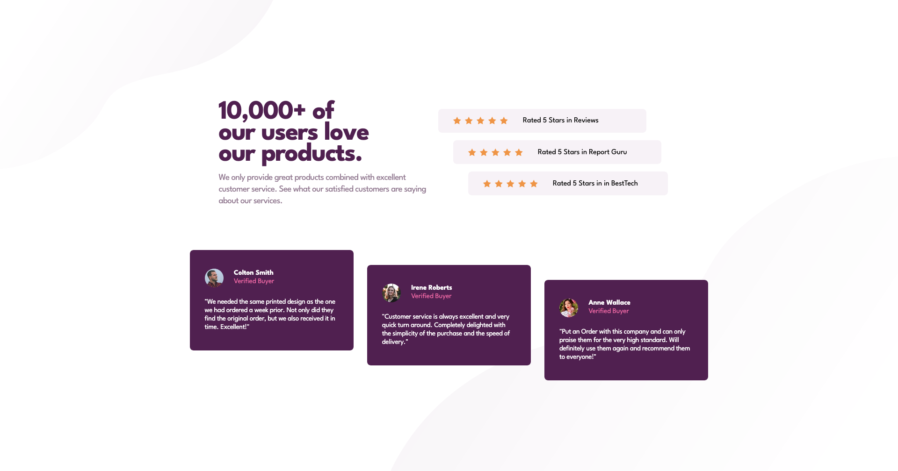

# Frontend Mentor - Social proof section solution

This is a solution to the [Social proof section challenge on Frontend Mentor](https://www.frontendmentor.io/challenges/social-proof-section-6e0qTv_bA). Frontend Mentor challenges help you improve your coding skills by building realistic projects.

## Table of contents

- [Overview](#overview)
  - [The challenge](#the-challenge)
  - [Screenshot](#screenshot)
  - [Links](#links)
- [My process](#my-process)
  - [Built with](#built-with)
  - [What I learned](#what-i-learned)
  - [Useful resources](#useful-resources)
- [Author](#author)

## Overview

### The challenge

Users should be able to:

- View the optimal layout for the section depending on their device's screen size

### Screenshot

### Links

- Solution URL: [Frontendmentor Solution](https://www.frontendmentor.io/solutions/social-proof-section-solution-with-vanilla-html-and-css-eqBnrnkAhn)
- Live Site URL: [Github Pages](https://kamal-redzwan.github.io/14-frontendmentor-social-proof-section/)

## My process

### Built with

- Semantic HTML5 markup
- CSS custom properties
- Flexbox
- CSS Grid
- Mobile-first workflow

### What I learned

- Practiced grid layout with fixed widths
- Learn how to positioning the card and ratings using nth child and margins
- Using what I've learn from previous challange on the background shorthand value.

### Useful resources

- [Grid Fixed Columns](https://bluephrase.com/style/grid/grid-template-columns.blue)
- [:nth-child() pseudo Selector ](https://developer.mozilla.org/en-US/docs/Web/CSS/:nth-child)
- [MDN Background](https://developer.mozilla.org/en-US/docs/Web/CSS/background)

## Author

- Website - [Kamal Redzwan](https://www.kamalredzwan.com)
- Frontend Mentor - [@kmlrdzwn](https://www.frontendmentor.io/profile/kmlrdzwn)
- Twitter - [@kamalredzwan](https://www.twitter.com/kamalredzwan)
